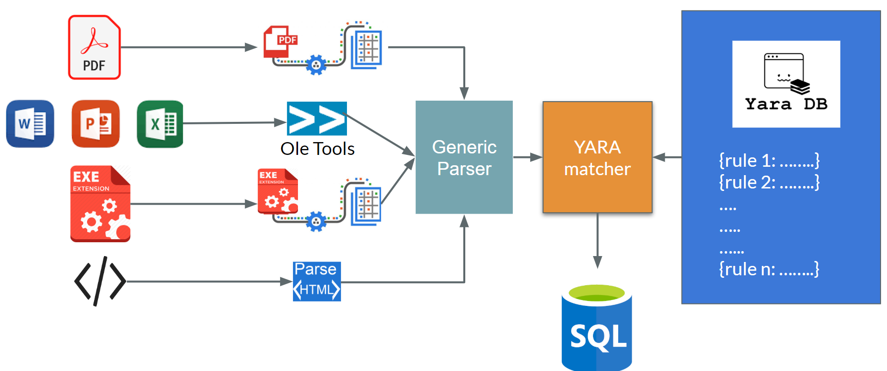

# MALERT (Malware + Alert)

<p align="center">
  
</p>

Malert is a tool for static malware analysis which can run on all kinds of files, including pdf, office files, exe, etc, and tell if any of the file is malicious or not, without actually running it on your machine. 

Malert is able to do this by scanning through the files and integrating YARA rules while walking through them. 

## To run the tool, follow these steps:

1. Clone the repo

2. Create a virtual environment 
```
virtualenv pyenv
```

3. Install the requirements
```
pip install -r requirements.txt
```

You're all set!

## How to use the tool:

###### If you're testing on one single file:

```
python app.py -f <insert path to file>  -y <flag> -e <flag> -s <flag>
```

You can set -y flag to 0/1 if you want to see the aligning YARA rules

You can set -e flag to 0/1 if you want to extract metadata information

You can set -y flag to 0/1 if you want to store the information in the database

## How Malert Works

<p align="center">
  
</p>


